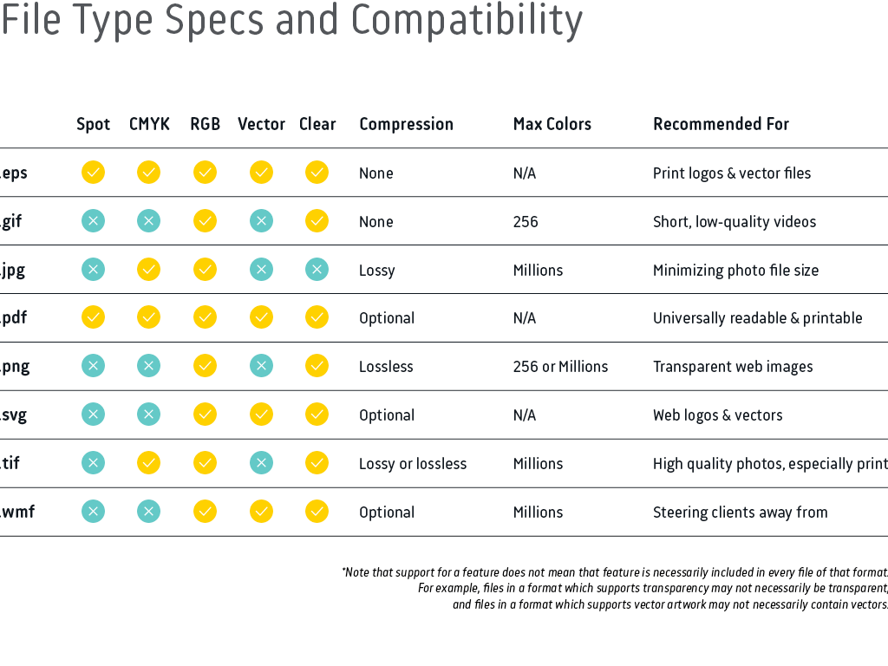

If you're like me, you've probably spent some time wondering (and Googling) about the differences between various popular format types commonly used for graphic design applications. I've found out I used or exported the wrong kind more times than I care to admit, and I've asked or been asked the difference between a jpeg and a tiff on countless occasions. Even now it's difficult sometimes to remember whether certain file types support things like CMYK color or transparency, and so I decided I'd create a resource that's hopefully a handy reference on the matter of discerning file type supports and behavior.

Someday I intend to update this into a browser-rendered chart, but for now, due to time constraints, it will just have to exist as a graphic.

**A few notes about the chart and its summary:**

- **.jpg** tends to be the best format for a photo or image with many colors where image size is a concern (especially on the web).
- **.tiff** is the ideal format for photo and raster applications where quality is the priority.
- **.tiffs** and **.jpgs** each support both RGB and CMYK, but this does not mean that a single tiff or jpeg file can be used for either application. In other words, .tiffs and .jpgs can exist as _either_ CMYK or RGB files, but not both at the same time.
- **.png** is ideal for transparent raster images on the web _or_ for web images with a low number of colors where compression may degrade quality (e.g., logos at fixed sizes or illustrations with large areas of flat color).
- **.svg** files (as their name implies) are designed for getting vectors to function and render on the web, as well as dynamic web animation. Ideal for logos on the web and other images that may need to display well at multiple sizes.
- **.eps** and **.pdf** have mostly the same functionality, and if you have the right software at your disposal they're largely interchangeable. However, .pdf is much more universal. This makes .eps a great choice for embedding or editing individual images (though .pdf also works for this purpose) and pdf better for outputting content for the end user to view or read. Regardless, they're both pretty much your only option for Pantone/spot colors, outside of Adobe's native file formats (.ai, .indd, etcetera). For more on that topic, see my post [Pantone®, Color, and What I Wish I Had Known](https://api.joshcollinsworth.com/pantone/).
- **.gifs** are still out there, but aside from animation, there's nothing a .gif can do that a .png can't do as well or better.
- If you don't know this already, if there's an X in the CMYK column above, don't use that format for print (unless you're printing a screenshot for some reason).
- You may have noticed that .jpg is the only format above not capable of supporting transparency. Don't waste your time trying to create a clear .jpg (or exporting an all-white Photoshop document as a .jpg without inserting a dark background first).
- Not shown in the chart but important: _screens have a native resolution of 72 dpi, while print has a native resolution of 300 dpi._ Thus, an image that's 1800 pixels wide in web resolution will likely be larger than your screen can display at full size, but will only be five inches wide at print resolution. Keep this in mind when working with raster files.
- It's increasingly rare (thankfully) that a client would request a .wmf; I just included it on this chart in case it happens.

If you have any questions or comments, please let me know!
